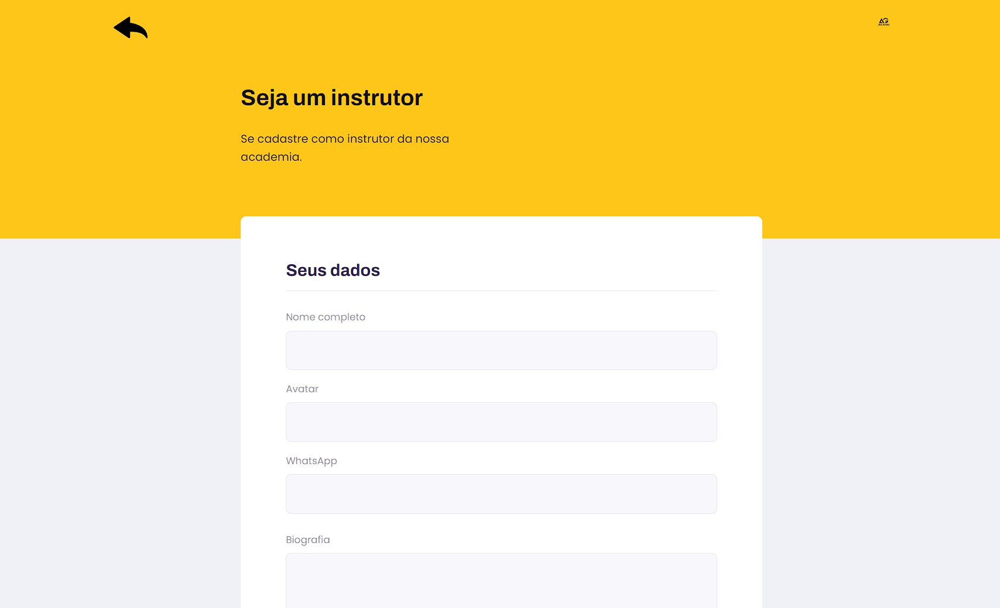
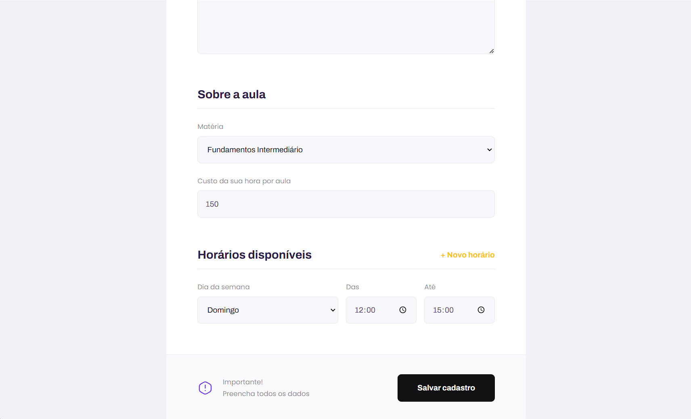

# AG Jiu-Jitsu

Este é um projeto fullstack web para marcação de aulas particulares de jiu jitsu para a academia AG Jiu-Jitsu, composto por um frontend em React e um backend em Node.js. Para maiores informações acesse: https://agjiujitsu.com.br/login


<center></center>

## Telas iniciais da aplicação

<table>
  <tr>
    <td></td>
    <td></td>
    <td></td>
 
  </tr>
</table>

## Funcionalidades

- Os instrutores podem cadastrar dias e horários disponíveis para dar aula.
- Os instrutores podem cadastrar o valor cobrado por hora de aula.
- Os usuários podem se cadastrar e fazer login para acessar o sistema.
- Os usuários podem visualizar a lista de instrutores disponíveis.
- Os usuários podem marcar e cancelar aulas.


## Tecnologias Utilizadas

### Frontend

- React
- React Router
- TypeScript
- CSS3
- Axios (para comunicação com o backend)

### Backend

- Node.js
- TypeScript
- Express.js (para criação da API)
- SQLite3 (para armazenamento de dados)
- Knex (SQL query builder)
- JWT (para autenticação de usuários)
- Bcrypt (para criptografia de senhas)

## Instalação

Esse projeto esta utilizando node v16.20.0, por favor, use o NVM para alterar entre versões.

1. Clone este repositório:

```
git clone https://github.com/seu-usuario/nome-do-repositorio.git
```

2. Instale as dependências do frontend:

```
cd frontend
yarn install
```

3. Instale as dependências do backend:

```
cd ../backend
yarn install
```

4. Configure as variáveis de ambiente no backend. Você precisará criar um arquivo `.env` na pasta `backend` com as seguintes variáveis:

```
PORT=3001
JWT_SECRET=sua-chave-secreta-para-jwt
```

5. Inicie o servidor backend:

```
yarn start
```

6. Inicie o servidor frontend:

```
cd ../frontend
npm start
```

## Contribuindo

Contribuições são bem-vindas! Sinta-se à vontade para abrir uma issue ou enviar um pull request com melhorias, correções de bugs ou novas funcionalidades.


